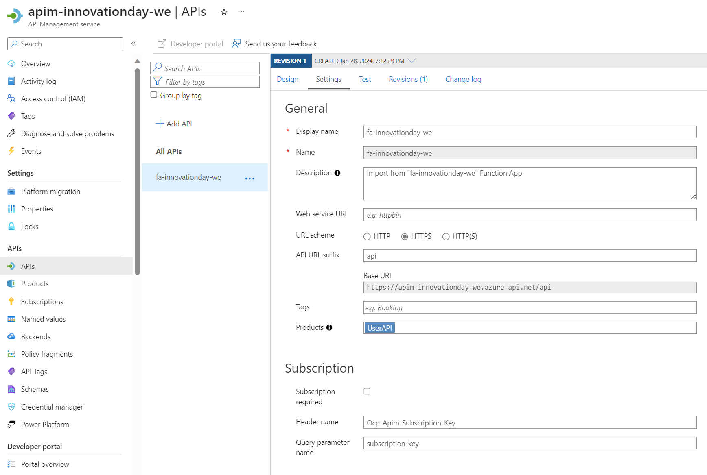

1. Add a Cors validation policy to the product pointing at the frontend FQDN
1. Make sure imported AzFunc APIs are set this way :
   
1. Add a `validate-jwt` policy to the APIM Users Product :
   ```xml
   <policies>
      <inbound>
         <base />
         <cors allow-credentials="false">
               <allowed-origins>
                  <origin>https://web-trash-we.azurewebsites.net</origin>
               </allowed-origins>
               <allowed-methods>
                  <method>GET</method>
                  <method>POST</method>
               </allowed-methods>
         </cors>
         <validate-jwt header-name="Authorization" failed-validation-httpcode="401" failed-validation-error-message="Unauthenticated client">
               <openid-config url="https://sts.windows.net/dbf66fc6-f491-4387-b638-101810058f9c/.well-known/openid-configuration" />
         </validate-jwt>
      </inbound>
      <backend>
         <base />
      </backend>
      <outbound>
         <base />
      </outbound>
      <on-error>
         <base />
      </on-error>
   </policies>
   ```
1. Create a JSON Schema named New-User-API:

   ```JSON
   {
      "$schema": "http://json-schema.org/draft-04/schema#",
      "type": "object",
      "properties": {
         "FirstName": {
            "type": "string",
            "pattern": "^[a-zA-Z0-9 .-]+$"
         },
         "LastName": {
            "type": "string"
         },
         "PartitionKey": {
            "type": "string"
         },
         "RowKey": {
            "type": "string"
         }
      },
      "required": [
         "FirstName",
         "LastName"
      ]
   }
   ```

1. Create a Json Validate Content (Schema Validation Policy) attached to the `Create Users` operations:

   ```XML
   <policies>
      <inbound>
         <base />
         <set-backend-service id="apim-generated-policy" backend-id="fa-innovationday-we" />
         <validate-content unspecified-content-type-action="prevent" max-size="1024" size-exceeded-action="prevent" errors-variable-name="usersValidationError">
               <content-type-map missing-content-type-value="application/json">
                  <type from="application/hal+json" to="application/json" />
               </content-type-map>
               <content type="application/json" validate-as="json" action="prevent" schema-id="New-Users-API-Schema" />
         </validate-content>
         </inbound>
         <backend>
            <base />
         </backend>
         <outbound>
            <base />
         </outbound>
         <on-error>
            <base />
         </on-error>
   </policies>
   ```
